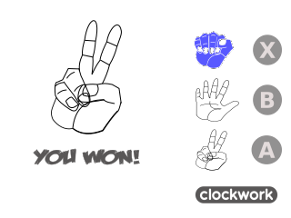

# gsrps
The simple Rock Paper Scissors created by Python and Pygame for gameshell. 

you can run it on your PC too , run game.py

The Rock Paper Scissors Icons source :
https://opengameart.org/content/rock-paper-scissors-icons

The game modes comes from here :
https://github.com/goelp14/RockPaperScissors

# ToDo-List
- [ ] Add another modes : Intermediate , Expert
- [ ] Add Server Client feature
